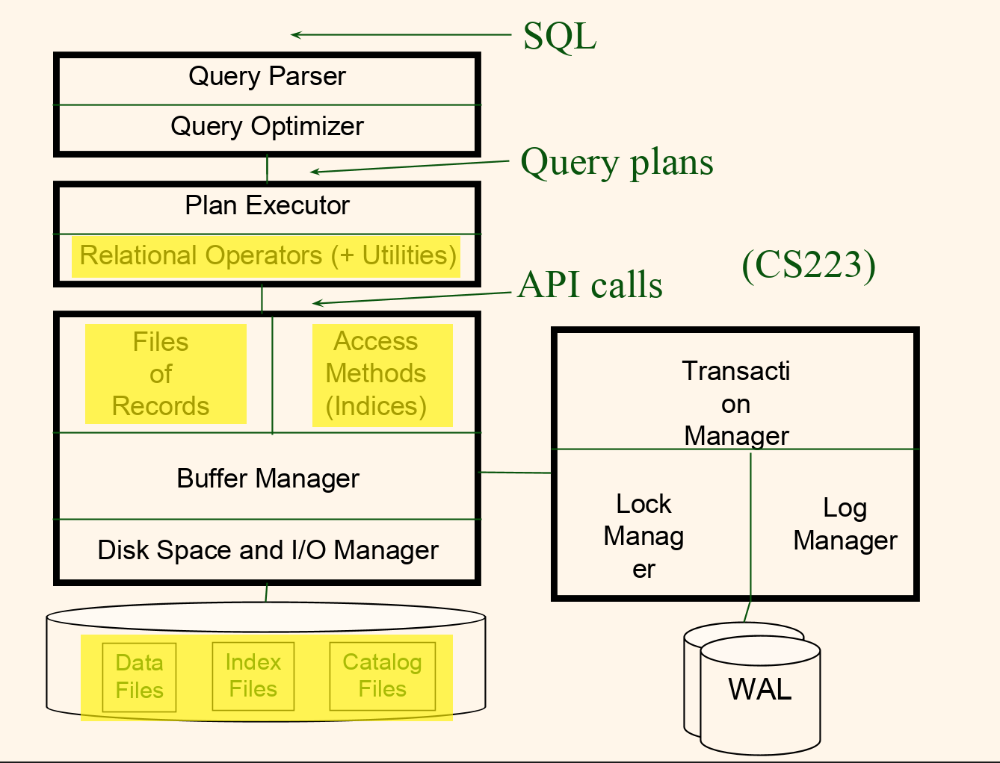

Course work for cs222p.

### Overview

### Detail

#### Record-Based File Manager (RBF)
[Description](./course-details/project1-description.pdf)

Implemented all requirements and also introduces the free space pages to save all data pages' remain spaces.

- [ ] hidden pages' reading times not counted

#### Relation Manager (RM)
[Description](./course-details/project2-description.pdf)

Implemented all basic requirements.

- [ ] add/drop attributes after a table is created

#### Index Manager (IX)
[Description](./course-details/project3.pdf)

Implemented all basic requirements.

- [ ] B+ tree deletion (current is lazy-deletion meaning no adjustment performed when deleting an entry)
- [ ] Entries that share the same key and that may span multiple pages is not supported

#### Query Engine (QE)
[Description](./course-details/project4.pdf)

Implemented all requirements.

- [ ] Join only supports equal condition.
